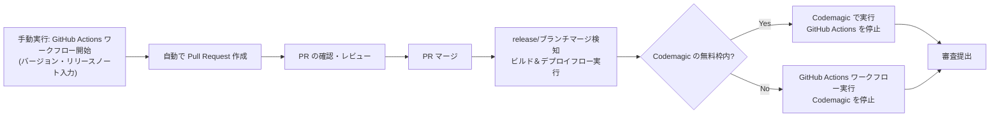
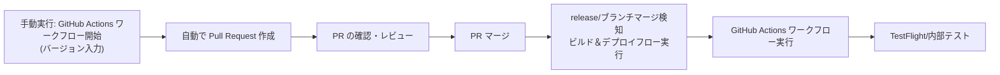
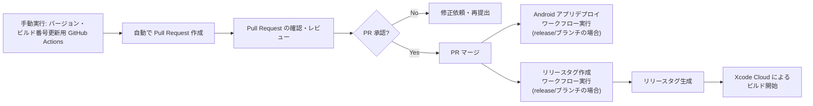

## はじめに

こんにちは！Altive株式会社のFlutterアプリ開発者の小林遼太（[@naipaka](https://twitter.com/naipakapaka)）です🦙

私はチーム開発で CI/CD 周りの構築を依頼されることがたまによく（？）あり、個人開発から実務での運用まで色々と試してきました。

今回は、現在実際に運用しているFlutter アプリのデプロイフローについて紹介します！

## 自動デプロイフローの変遷

自分が構築してきたデプロイフローは、個人開発時から現在に至るまで色々と変化しています。
主に iOS の署名に関わる問題によって変更を余儀なくされた形です…
ここではその変遷を簡単に紹介します！

### 個人開発：fastlane (match) + GitHub Actions + Codemagic

初めて Flutter アプリのデプロイフローを構築したのは個人開発アプリです。
以下のようなフローで運用しています：



手動で GitHub Actions ワークフローを実行し、バージョン番号とリリースノートを入力します。その後、自動で Pull Request が作成され、レビューを経てマージされると、`release/` ブランチマージを検知してビルド＆デプロイフローが実行されます。

元々、iOS アプリ開発を少し経験していたのもあり、当時の証明書やプロビジョニングプロファイルの管理には [fastlane match](https://docs.fastlane.tools/actions/match/) が便利で利用していました。

Codemagic と GitHub Actions のワークフローではそれぞれ同じように iOS アプリと Android アプリをビルドするワークフローを組んでいました。
それぞれで同じフローを組んでいたのは、「コスト削減」と「冗長性」を考慮して、Codemagic の無料枠を使い切った場合に備えていたためです。

また、[fastlane](https://docs.fastlane.tools/) を使って、リリースノートを管理しつつ、iOS/Android アプリのデプロイ・審査提出までを自動化していました。

### 実務導入：Automatically manage signing + GitHub Actions

実務で初めて導入したときは、GitHub Actions のみを使用したデプロイフローに切り替えました。



fastlane (match) を使用しなかったのは、すでに `Automatically manage signing` を有効にしていたことや、fastlane match の学習コストや証明書の管理コストを削減したかったためです。

また、Android においても iOS に合わせて、 fastlane ではなく GitHub Actions のワークフロー内でビルド・デプロイを行うように変更しました。

iOS アプリのビルドにおいて `Automatically manage signing` を有効にしている場合の対応に苦労しましたが、以下の記事を参考にさせていただき構築することができました。

https://zenn.dev/yorifuji/articles/build-automatically-manage-singin-on-ci
https://zenn.dev/welchi/articles/flutter-ios-ci-cd-xcode-cloud

ただ、記事にも記載がある通り、そのままだとiOSアプリにおいて `entitlements` への署名が行われないため、プッシュ通知などを使用するアプリが起動時にクラッシュする問題が発生しました。

それを解決するために、アーカイブ時点で署名する必要があるのですが、開発者署名を GitHub Secrets に追加する必要があったり、macos-13 runner でのビルドが必要でそれ以上だとエラーが発生するなど、かなりつらみがありました。

参考にさせていただいたスクラップ：
https://zenn.dev/ohtsuki/scraps/799e5b7c3f2498#comment-c56842ac128951


### 現在：GitHub Actions と Xcode Cloud の併用

`Automatically manage signing` + GitHub Actions のつらみを解消すべく、
現在は、GitHub Actions と Xcode Cloud を組み合わせたワークフローを採用しています。

Android アプリのビルドは引き続き GitHub Actions で行い、iOS アプリのビルドは Xcode Cloud で行うようにしました。

たまに Xcode のバージョン差異などで失敗することがあったりとつらみはありますが、それ以外は安定して運用できているため、今のところはこのフローを継続していく予定です。

以下で、現在のデプロイフローについて詳しく説明していきます！

## ブランチ運用

前提として弊社では以下の3種類のブランチのみを運用しています：

- `main` ブランチ：安定版コードを管理するメインブランチ
- `feature/*` ブランチ：新機能開発用のブランチ
- `release/*` ブランチ：リリース準備用のブランチ

詳細なブランチ運用ポリシーについては、以下の記事で詳しく解説していますので、興味のある方はこちらをご覧ください。

https://zenn.dev/altiveinc/articles/git-branch-merge-policy

## デプロイの流れ

それでは、具体的なデプロイの流れについて説明します。以下の図は、現状のデプロイフロー全体を表しています。



### Step 1: バージョン・ビルド番号更新用 GitHub Actions ワークフローの実行

デプロイ作業は、バージョンとビルド番号を更新するためのGitHub Actionsワークフローを実行するところから始まります。
このワークフローは手動で実行し、その際にバージョン番号を入力パラメータとして指定する形になっています。

以下は、バージョン・ビルド番号更新用のGitHub Actionsワークフローの例です：

https://github.com/altive/flutter_app_template/blob/main/.github/workflows/create-release-pull-request.yml

```
altive/.github/.github/workflows/create-release-pull-request-for-flutter-app.yaml@main
```

`create` ジョブの `uses` に指定している上記ファイルは以下で、他のプロジェクトでも共通利用できるようにしています。

https://github.com/altive/.github/blob/main/.github/workflows/create-release-pull-request-for-flutter-app.yaml

また、引数で、Github App の ID と秘密鍵を渡しており、それを用いて GitHub App で Pull Request を作成しています。
これは、`GITHUB_TOKEN` を使うとCIが動かなくなる問題を回避するためです。

現状、弊社では基本 CI が全てパスしないとマージができないようにしているため、CIが動かないということはリリースができないということになります。

https://docs.github.com/ja/apps/creating-github-apps/about-creating-github-apps/about-creating-github-apps

このワークフローが実行されると、バージョン番号とビルド番号が更新された新しい Pull Request が作成されます。


### Step 2: Pull Request の確認とマージ

ワークフローによって自動生成された Pull Request でバージョン番号とビルド番号が適切に更新されているかを確認します。

リポジトリのルールとしては、CI のチェックがすべてパスしていることがマージの条件となっています。
すべての確認が完了したら、Approve して Pull Request を main ブランチにマージします。

### Step 3: マージ後に実行されるワークフロー

Pull Requestがマージされると、条件によって以下の2つのワークフローが実行されます。
これらは、以下の記述でマージされた Pull Request のブランチ名に「release/」が含まれている場合にのみ実行されます。

```yaml
    if: github.event_name == 'workflow_dispatch' || (github.event.pull_request.merged == true && contains(github.head_ref, 'release/'))
```

#### (a) Android アプリのデプロイワークフロー

このワークフローでは、Android アプリをビルドし、Google Play Console の内部テストにアップロードします。
ビルドに必要な証明書やキーストアは GitHub Secrets に保存されており、ワークフロー内でそれらを利用してビルドを行います。

https://github.com/altive/flutter_app_template/blob/main/.github/workflows/upload-production-android-app.yaml

`./.github/actions/upload_android_app` の中身は以下のようになっています：

https://github.com/altive/flutter_app_template/blob/main/.github/actions/upload_android_app/action.yml

#### (b) リリースタグ作成ワークフロー

このワークフローは、リリースブランチのバージョン情報を抽出し、それに基づいてリリースタグを自動生成します。

monorepo 構成で複数アプリがある場合は、ブランチ名からアプリ名を取得して、適切なリリースタグを生成するように変更したりカスタマイズしています。

https://github.com/altive/flutter_app_template/blob/main/.github/workflows/create-release-tag.yaml

### Step 4: Xcode Cloud を用いたビルドの実行

最後のステップは、Xcode Cloud を使用したiOSアプリのビルドです。
Xcode Cloud は、リリースタグ（例：v1.2.3）が作成されると自動的にビルドを開始するように設定しています。

この方法を採用した主な理由は以下の通りです：

1. **リリースタグのトリガー**：`release` ブランチのマージではXcode Cloudのビルドを直接トリガーできなかったため、タグ作成をトリガーイベントとして採用

2. **証明書管理の簡素化**：`Automatically manage signing` を有効にしていても、Xcode Cloudは証明書の管理を自動化してくれるため、証明書関連の問題が発生しにくい

3. **macOS環境の安定性**：GitHub Actions の `macos-14` 以降ではビルドが安定しない問題があるため、Xcode Cloud を使用することで安定したビルド環境を確保

4. **コスト効率**：Xcode Cloud は月25時間分の無料枠があり、GitHub Actionsの有料macOSランナーを使うよりもコスト効率が良い

Xcode Cloudのセットアップと詳細については、以下のスクラップで詳しく解説していますので、参考にしていただけると嬉しいです。実際にこの手順で導入しています！

https://zenn.dev/naipaka/scraps/807963171ec6d9

## つらみポイント

現在のデプロイフローでひとまず落ち着きましたが、いくつかの課題が残っています。

### Xcode Cloud のビルド番号管理

Xcode Cloudのビルド番号がこれまでのアプリのビルド番号や `pubspec.yaml` と連動していないという問題があります。
Xcode Cloud自体がビルド番号を独自に管理するため、以下のようなシナリオで問題が発生します：

1. `pubspec.yaml` でバージョンを "1.2.3+45" に設定
2. 何らかの理由でXcode Cloud上で同じタグの再ビルドが必要になった場合
3. 再ビルド時にXcode CloudはiOSビルド番号を自動的にインクリメント
4. 結果として、ビルド番号が "1.2.3+46" になってしまい、`pubspec.yaml` との整合性が取れなくなる（Android アプリとの整合性も取れなくなる）

この問題を完全に解決する方法はまだ見つかっておらず、一旦手動でビルド番号を調整している状況です。

## さいごに

本記事では、試行錯誤を経て構築してきたFlutterアプリのデプロイフローについて紹介しました。

Flutter の開発環境やツールは日々進化しており、最適なデプロイフローも変わっていく可能性があります。
本記事が皆様のデプロイフロー構築の参考になれば幸いです！

また、他の会社や開発チームがどのようなデプロイフローを採用しているのかについても非常に興味があります。
もし独自のデプロイフローやベストプラクティスがあれば、ぜひコメントや記事で共有していただけると嬉しいです！

最後まで読んでいただき、ありがとうございました🙇‍♂️
